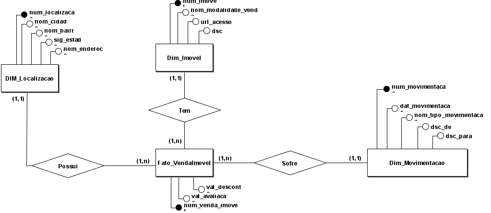
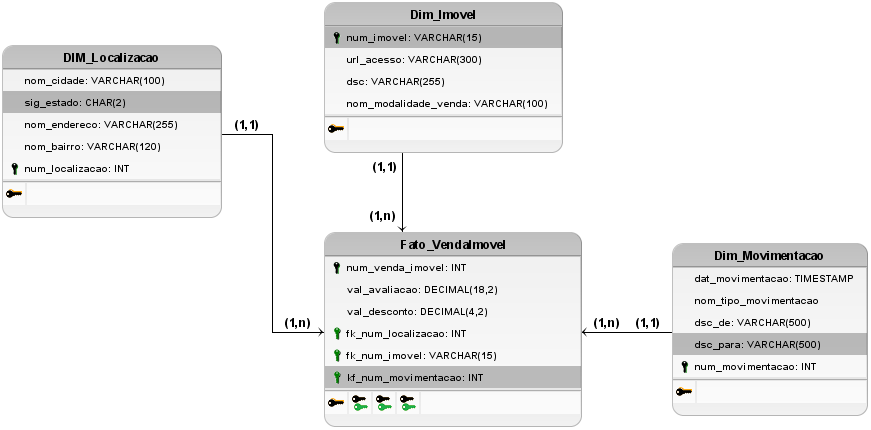

# Artefátos do Banco de dados (Gold)
## MER (Modelo Entidade Relacionamento)

## Entidades

- Dim_Imovel(<u>NumeroImovel</u>, Preco, Descricao, LinkDeAcesso, ModalidadeVenda)
- Dim_Localizacao(<u>LocalizacaoId</u>, Cidade, Bairro, UF, Endereco)
- Dim_Movimentacao(<u>MovimentacaoId</u>, De, Para, DataMovimentacao, TipoMovimentacao)

- Fato_VendaImovel(<u>VendaImovelId</u>, NumeroImovel, LocalizacaoId, MovimentacaoId, DataAvaliacao, Desconto)

## Relacionamento

### Relacionamento entre Fato_VendaImovel e Dim_Imovel
Esta relação liga o evento de venda/oferta ao imóvel específico ao qual ele se refere.

Chave Estrangeira (FK) na Fato: Fato_VendaImovel.NumeroImovel

Chave Primária (PK) na Dimensão: Dim_Imovel.NumeroImovel

Cardinalidade: Muitos-para-Um (N:1).

Um registro de imóvel em Dim_Imovel (1) pode ser associado a Muitas linhas (eventos de venda/oferta) em Fato_VendaImovel (N).

Uma linha em Fato_VendaImovel (o evento de venda) refere-se a Um único imóvel em Dim_Imovel.

### Relacionamento entre Fato_VendaImovel e Dim_Localizacao
Esta relação associa o evento de venda/oferta ao local onde o imóvel está situado.

Chave Estrangeira (FK) na Fato: Fato_VendaImovel.LocalizacaoId

Chave Primária (PK) na Dimensão: Dim_Localizacao.LocalizacaoId

Cardinalidade: Muitos-para-Um (N:1).

Um registro de localização em Dim_Localizacao (1) pode ser associado a Muitas linhas (eventos de venda/oferta) em Fato_VendaImovel (N).

Uma linha em Fato_VendaImovel refere-se a Uma única localização em Dim_Localizacao.

### Relacionamento entre Fato_VendaImovel e Dim_Movimentacao
Esta relação liga o evento de venda/oferta a um histórico de movimentação ou status do imóvel.

Chave Estrangeira (FK) na Fato: Fato_VendaImovel.MovimentacaoId

Chave Primária (PK) na Dimensão: Dim_Movimentacao.MovimentacaoId

Cardinalidade: Muitos-para-Um (N:1).

Um registro de movimentação/status em Dim_Movimentacao (1) pode ser associado a Muitas linhas (eventos de venda/oferta) em Fato_VendaImovel (N).

Uma linha em Fato_VendaImovel refere-se a Uma única movimentação/status em Dim_Movimentacao.

## DER (Diagram Entidade Relacionamento)

## DLD (Diagrama Lógico de Dados)

