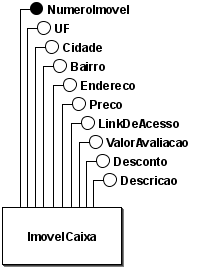
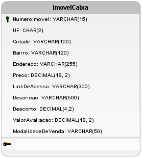

# Artefátos do Banco de dados (Silver)
## MER (Modelo Entidade Relacionamento)

### Entidades

- ImovelCaixa(<u>NumeroDoImovel</u>., UF, Cidade, Bairro, Endereco, Preco, ValorAvaliacao, Desconto, Descricao, ModalidadeDeVenda, LinkDeAcesso)

### Relacionamento

Não foram planejado relacionamentos entre as tabelas por se tratarem da primeira camada de dados e se tratar de uma base pequena.

## DER (Diagram Entidade Relacionamento)

## DLD (Diagrama Lógico de Dados)

